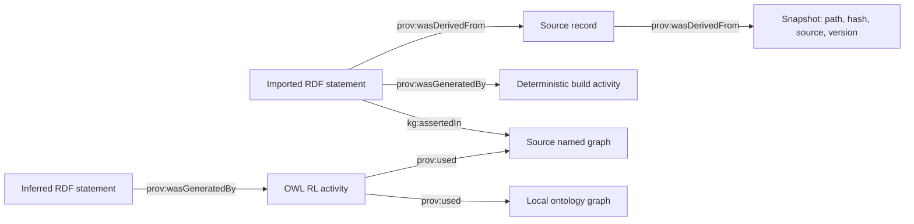

# Provenance and reproducibility model

The authoritative artifact is `data/processed/knowledge_graph.nq`. Its named graphs are:

- `…/graph/source/mondo`
- `…/graph/source/hpo-ontology`
- `…/graph/source/hpo-annotations`
- `…/graph/source/ot-disease`
- `…/graph/source/ot-phenotypes`
- `…/graph/schema`
- `…/graph/provenance`
- `…/graph/inferred`
- `…/graph/validation` (canonical SHACL report)

The default graph is empty; competency queries name source contexts explicitly. `asserted.ttl` is a convenience union of source facts and loses graph separation; it is not a replacement for the dataset. `review.ttl` adds the project ontology for Protégé inspection.

Every distinct source quad is covered by at least one `kg:ImportedAssertion`. Each statement has subject, predicate, object, source graph, record and build activity. Duplicate physical evidence occurrences have separate record/assertion identifiers even when the RDF fact is identical. A dataset-aware coverage check verifies the statement actually occurs in the named source graph and its provenance chain is complete.

Record locators are one-based physical HPOA line numbers, zero-based Parquet physical row indices (plus zero-based nested evidence indices), or OWL class IRIs. Parquet rows are streamed in physical order. Records carry original disease or concept identifiers and a JSON payload. HPOA and selected OT disease rows retain full rows; OT phenotype evidence records retain the disease/phenotype keys and full individual evidence struct; OWL records retain the explicitly documented class projection. Source paths and hashes allow the full original record to be recovered.

`kg:ImportedAssertion` refers to an imported **projection**: project-level entity types and normalized predicates are mapping outputs, not claims that those exact project IRIs occur in raw data. The payload and extraction code expose that transformation. Record evidence fields and provenance metadata are modeled on the source record itself, rather than recursively reifying provenance statements.

The build activity has a deterministic fingerprint over the frozen manifest, implementation, ontology, queries, configuration and pinned requirements. The freeze observation time is recorded separately from unknown acquisition dates. Repeating a build reproduces the same logical activity identifier; this is a reproducible transformation identity, not a claim that two wall-clock executions occurred simultaneously.

Each inferred statement records the reasoning activity and output graph. That activity identifies all source graph and ontology premises. This is process-level inference lineage, not a minimal proof for every closure triple. `reasoning_examples.json` supplies human-readable explanations and inverse-property premises. No inferred facts are relabeled as source assertions.

Some OWL RL internal closure triples have literal subjects and are generalized RDF. They are counted and excluded from standard RDF export. The exported RDF/OWL bookkeeping count is distinguished from the useful inference examples. Every exported artifact is reloaded and compared to its original graph/dataset before the build succeeds.

100% statement provenance means all imported source quads have this complete recorded chain. It does **not** mean download history, release authenticity, independent evidence, or clinical correctness has been verified. OT release provenance remains user-declared; missing original download URLs/dates remain null.
